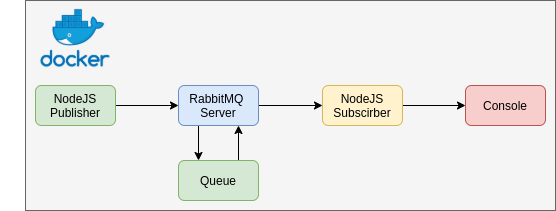

# RabbitMQ Publish-Subscribe with Nodejs and Docker

## Workflow

This project is a simple rabbitMQ messaging queue architecture with one publisher and one subscriber with a communicating through a queue named "diaf-queue" using Docker.




Everything is automatic in this project.

All you have to do is run a simple script that will trigger everything.

You can then dive deeper into code and play around with it to get your hands dirty 😊

## Requirements

*   Docker & Docker Compose (https://docs.docker.com/engine/install/ubuntu/)
    *   docker >= 19.X.X 
    *   docker-compose ~1.29.2

> Please make sure:
*   you can run commands with root privileges (sudo)
*   your ports 5672, 15672, 13000, 23000  is not in use
*   the subnet 172.18.0.0/24 is not in use in your computer

## Project folder structure

```
.
├── architecture.png........ # Architecture of the project
├── docker-compose.yml...... # Create rabbitMQ cluster and pubsub services
├── subscriber......... # Subscribe to queue
│   ├── subscriber.js
│   ├── Dockerfile
│   ├── package.json
├── publisher......... # Publishes messages to queue
│   ├── Dockerfile
│   ├── package.json
│   └── publisher.js
├── README.md
└──build.sh.......... # Builds containers to dockerhub (change this file if you use another container registry)
```

## Running services

| service name | address     | internal ports | external ports |
|--------------|-------------|----------------|----------------|
| rabbitmq     | 172.18.0.8  | 5672, 15672    | 5672, 15672    |
| publisher    | 172.18.0.9  | 3000           | 13000          |
| subscriber   | 172.18.0.10 | 3000           | 23000          |

The project creates a docker network named "rabbitmq-pubsub" on the address range 172.18.0.0/24

## Getting Started

> Note: You can go through the docker-compose.yml or the build.sh files to better understand how things work. 

### 1. Clone the repo and cd into the folder

```
git clone https://github.com/MDiakhate12/rabbitMQ-pubsub-with-nodejs-and-docker.git
cd rabbitMQ-pubsub-with-nodejs-and-docker/
```

### 2. Build containers
> Note: This file contains environment variable for your docker username. You can use any container registry that you want if you prefer not to push to Dockerhub
```bash
sudo chmod +x ./build.sh
export DOCKER_USERNAME=*YOUR_DOCKER_ID* && ./build.sh
```

### 3. Run docker-compose.yml

> Important: Don't close the terminal after you have executed docker-compose <br>

```
docker-compose up # Wait until all services are up
```

That's it 🎉🎉 Congratulation.

## Look at the result

On a new terminal, you can see logs of each service by running:

```
docker-compose logs -f [SERVICE_NAME]
```

Available services are:
1.  rabbitmq
2.  publisher
3.  subscriber

### 4. Clean the environment
> Note: If you have used another registry, you must update the docker rmi command
```bash
export DOCKER_USERNAME=*YOUR_DOCKER_ID*
docker-compose down
docker rmi \
    $DOCKER_USERNAME/rabbitmq-subscriber \
    $DOCKER_USERNAME/rabbitmq-publisher \
    $DOCKER_USERNAME/rabbitmq:3.8-management \
    $DOCKER_USERNAME/rabbitmq
```